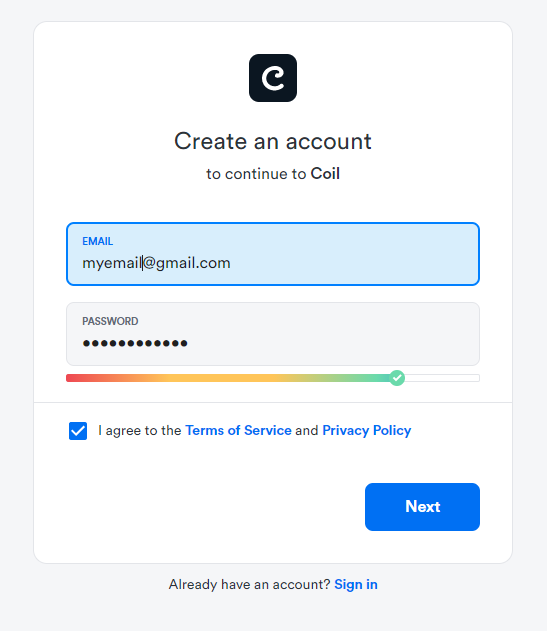
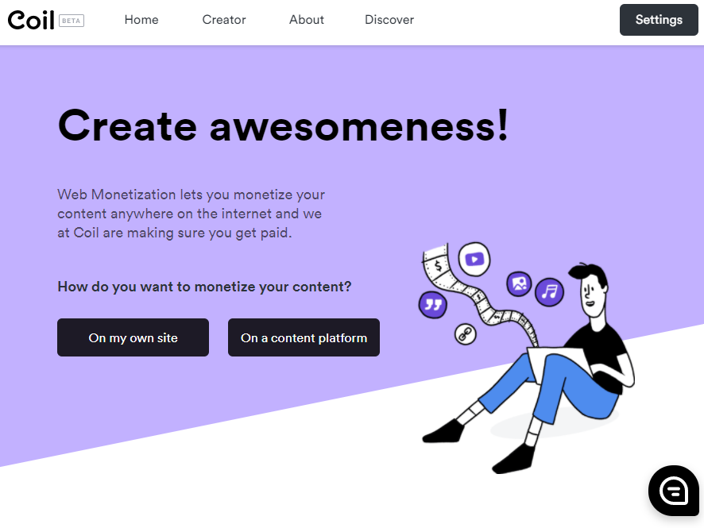
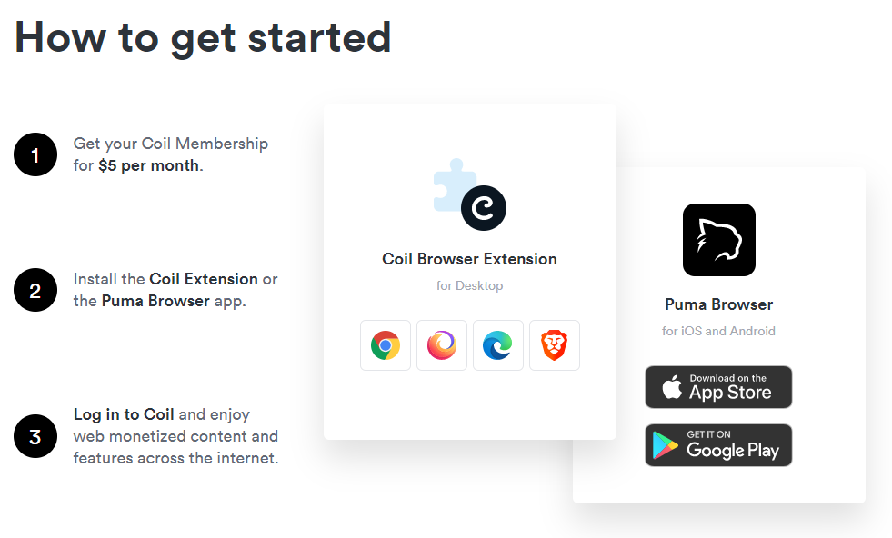
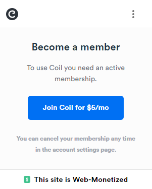

# Coil and Uphold

## Coil

As mentioned in the previous section, the players need a payment provider to enable them to stream micropayments automatically across all the Web Monetized sites and games they visit. If you want to know more about how the money is distributed then [click here](https://help.coil.com/docs/general-info/intro-to-coil/index.html#how-is-coil-different-from-other-membership-services-like-patreon-and-flattr).

Currently, the main provider is Coil. You will need to register with them in order to assign a Payment Pointer and be able to test that your games are correctly enabled for Web Monetization. Let's walk through the key parts of that process:

- Go to the official [Coil site](https://coil.com) and create an account by clicking on **Sign up**:

- Select the _Monetize Content_ option. You will need to sign-up to do this:

- Enter the required information:

- Go to your email and find the verification code you were sent and enter it:

Your Coil account is now ready for use. The next stage is to create a digital wallet.

## Uphold

We now need to create our wallet in order to receive payments. For this process we will use the service Uphold. There are other services avilable but we're going to walk through using Uphold because we found their user validation process the easiest and they had a wide variety of currencies available at the time of writing this. If you already have a wallet then you can, of course, skip this section.

It's useful to understand the relationship between Coil and Uphold, or similar services. Coil is used to _distribute_ the micropayments and Uphold is used to receive them. It is Uphold that will generate the payment pointers required to enable your game for Web Monetization.

Select Uphold and then click "[Get a Payment Pointer](https://help.coil.com/docs/monetize/wallets/uphold/index.html)"

Coil shows a good tutorial on how to get the payment pointer from Uphold, which is the most important thing to do in order to monetize your games.

At this point, after having created your accounts in Coil and Uphold, you should now have your Payment Pointer address. All that remains is to put it into the configuration of your Coil account and click "Finish".

Once this is done, it redirects us to home:

## Coil Extension

You may have already done this, but if not, it's time to install the Coil browser extension so that you can test if your games are properly enabled, or not.

Go to [https://coil.com](https://coil.com) and scroll down until you find **The Coil Extension and Puma Browser** section.

The extension is currently available for Chrome, Samsung Internet, Firefox, Microsoft Edge and Brave Browser. Chose the extension for the browser you're using. Alternatively, you could install the Puma Browser, but for this tutorial series we'll assume you're using an extension.

Once the extension is installed we can test if everything is working. You should be able to see the extension icon in your browser toolbar:

You will need to become a Coil member in order to make these tests. To test it's working you can check the official [Phaser homepage](https://phaser.io). If you click the Coil browser extension icon you should see this message if you are a Coil member:

Or this one if you are not:

And as you can see, even though we are not members, it appears at the bottom of the extension that the site is monetizable.

We have everything ready to start using the Game Web Monetization plugin.
