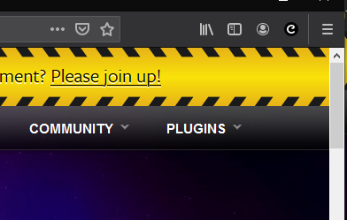
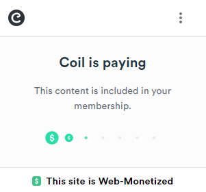

# Coil and Uphold

### Coil

As we have mentioned in the previous chapter, the user needs a provider so that he can send money and that this money is automatically distributed across all the pages visited (you want to know more about how the money is distributed: click [here](https://help.coil.com/docs/general-info/intro-to-coil/index.html#how-is-coil-different-from-other-membership-services-like-patreon-and-flattr)). Currently as provider we can use Coil so you will have to register on the official page and assign your payment pointer to be able to test that everything is working correctly.

- Go to the official Coil page [here](https://coil.com/) and create an account by clicking on **Sing up**

- Select: Monetize Content (Sign up to monetize)

- Fill your user data

- Go to your email and find your verification code and fill it

### Uphold

Once the code has been filled, we now need to create our wallet to receive payments, the choice here is yours but it was easier for us to use Uphold because the user validation is easier and faster, and it has many currencies available. So now You have to create an account in Uphold but first remember the following: Coil is used to distribute the money that the user enters but as a developer you are interested in knowing that everything is working so we will do monetization tests but the most important thing as a developer is to generate your wallet and get the payment pointer, so Uphold would be enough.

Select Uphold and then click where it says [Get a payment pointer](https://help.coil.com/docs/monetize/wallets/uphold/index.html) Coil will show us a pretty good tutorial on how to get that payment pointer which is the most important thing to be able to monetize your content since thanks to that payment pointer you will be able to receive the money.

At this point and after having created your account in Uphold you should already have your payment pointer and it only remains to put it in the configuration of your Coil account and click on: Finish.

Once this is done, it redirects us to home.

### Coil Extension

It's time to install the Coil extension so that we can do the tests correctly.

Click in **Home** or go to [https://coil.com](https://coil.com) and scroll down until you find **Install the Coil Extension** or **The Puma Browser** app.

Once the extension is installed we can test if everything is working.
You will be able to see the extension in your browser extensions bar:

You will likely you need to become a member and pay $5 the first time to take these tests.

At this point if you are on the official page of phaser (https://phaser.io) and click on the Coil extension icon you will see this.

If you are member:

If you are not a member:

And as you can see, even though we are not members, it appears at the bottom of the extension that the site is monetizable.

We have everything ready to start testing, see you in the next chapter.