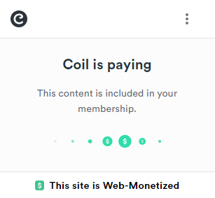
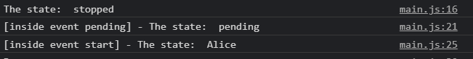

# An overview of the plugin

Let's get started implementing the Game Web Monetization plugin and see what features are available.

Before we can start you should have already signed-up with Coil and a digital wallet service provider like Uphold. If you've not done this yet, please return to [Part 2](part2) and do so, as everything from this point on relies on it.

Login to the [Coil website](https://coil.com) and then in **Settings** look for **Payouts** and you will see your Payment Pointer:


To check it's working, lets create a simple test page. Open your favorite editor (for this tutorial we'll use VS Code), create a new folder and inside of that save empty `index.html` and `main.js` files.


We'll edit `index.html` first and create its basic structure by calling `main.js` and defining it as a module:

```html
<!DOCTYPE html>
<html lang="en">
<head>
    <meta charset="UTF-8">
    <meta http-equiv="X-UA-Compatible" content="IE=edge">
    <meta name="viewport" content="width=device-width, initial-scale=1.0">
    <title>Game Web Monetization</title>
</head>
<body>
    <script src="./main.js" type="module"></script>
</body>
</html>
```

Now it's time to [download the Game Web Monetization plugin](https://github.com/photonstorm/gamewebmonetization/blob/main/plugin/dist/GameWebMonetization.js) - save this file alongside the index and main files you've already got:


This version of the plugin exposes itself as an ESM (ES Module), so we can load it directly in `main.js`. For this tutorial we're going to use imports and modern JavaScript. However, you can also find ES5 and TypeScript versions of the plugin in the GitHub repository, should you require them. For the rest of this tutorial, though, we'll assume you're using the ESM.

Let's edit `main.js` to import our plugin:

```javascript
import { GameWebMonetization } from './GameWebMonetization.js';
```

With the module imported we can instantiate the plugin. The constructor requires a configuration object that contains a `paymentPointer`. This is why it's important you've already obtained one from your wallet service.

Add the following to `main.js` and remember to replace the `paymentPointer` value below with your own:

```javascript
const gameWebMonetization = new GameWebMonetization({
    paymentPointer: '$ilp.uphold.com/zdXzL8aWJ4ii'
});
```

What we've done is import the module, create an instance of the plugin and assign a Payment Pointer to it. Now, we just have to start it.

Open `index.html` in a browser. For this tutorial we're using [Visual Studio Code](https://code.visualstudio.com/) with the [Live Server](https://marketplace.visualstudio.com/items?itemName=ritwickdey.LiveServer) extension, but you can use any method, so long as the file is being served to your browser and not just opened directly.

Once open, it will still appear that the site is not monetizable. This is because we have prepared the plugin but have not _started_ monetization:


Let's go back and edit `main.js` to start the monetization process. This is done with the `start()` method:

```javascript
import { GameWebMonetization } from './GameWebMonetization.js';
 
const gameWebMonetization = new GameWebMonetization({
    paymentPointer: '$ilp.uphold.com/zdXzL8aWJ4ii'
});
 
gameWebMonetization.start();
```

Now, if we go back to the browser and refresh we will see that our site begins to monetize itself:



**Congratulations!** This page is now streaming tiny amounts of currency into your digital wallet. If something went wrong remember to check:

1. That you have a Coil account with a subscription.
2. That you have fully verified your Uphold (or other wallet) service
3. That the Payment Pointer URL has been changed in the code to your own.
4. That you are serving the test page, not opening it directly in a browser.

With only this configuration you have already successfully monetized this page. However, it's important to at least give some reward to the players of your game. To do this you can take advantage of the methods and properties that the plugin offers. Let's dive into those now.

## Methods, Properties and Events of the Plugin

The plugin will emit four key events:

1. `start`
2. `stop`
3. `pending`
4. `progress`

You can listen for each of these from your game code because the Game Web Monetization Plugin is an Event Emitter. This means you can use the following methods directly on the plugin:

```js
once('event-name', eventHandler, context);
on('event-name', eventHandler, context);
off('event-name', eventHandler, context);
```

If you prefer to be more verbose, you can use `addListener` instead of `on` and `removeListener` instead of `off`. We will use the short version in the following code.

### The START Event

This event is emitted when Web Monetization API is successfully started.

To use it, you can bind your own listener to the `GameWebMonetization.START` event:

```js
gameWebMonetization.on(GameWebMonetization.START, (event) => {
    // Your handler
});
```

**Tip:** Remember to do this _before_ calling `start()` on the plugin!

To test this, let's make it log out some information to the console when the event fires, so we can observe what it returns in our browser Dev Tools:

Add the following code to your `main.js` file, _before_ you call `gameWebMonetization.start()`:

```javascript
gameWebMonetization.on(GameWebMonetization.START, (event) => {
    console.log(event);
});
```

If you now test this, you should see the following in your Dev Tools console:


The event handler is sent an object that contains the following properties:

property | details
--- | ---
`paymentPointer` | Your payment account URL. The same value is used as the content in your tag.
`requestId` | This value is identical to the session ID/monetization ID (UUID v4) generated by the user agent .

You may have noticed we've been sent both `paymentPointer` and a `requestId`.

You can use the `start` event to know that your game is being monetized. At this point you could show a message to the player, thanking them, or perhaps unlocking some extra content.

**Important:** Every time you change the browser window, or swap to another browser tab, the monetization stops. When the player returns to the window, the `start` event will be fired again. So be aware of this flow in your game code and handle it appropriately.

### isMonetized

The `start` event is useful to know when monetization _begins_, but what if you want to check if your game is monetized or not somewhere deeper in your code?

For this, you can use the `isMonetized` boolean property.

This property can be checked at any point in your game and provides a simple true/false response to the question "Has this player monetized my game?"

Let's test this by modifying our `main.js` to console log the state of the property before and after the `start` event:

```javascript
var gameWebMonetization = new GameWebMonetization({
    paymentPointer: '$ilp.uphold.com/zdXzL8aWJ4ii'
});

// New code:
console.log('Is monetized? ', gameWebMonetization.isMonetized);

gameWebMonetization.start();

// New code:
gameWebMonetization.on(GameWebMonetization.START, (event) => {
    console.log('[inside event start] - Is monetized? ', gameWebMonetization.isMonetized);
});
```

If you test this code you'll see that before the monetization starts the property is `false` and it switches to `true` after the `start` event has fired:


You you can check the `isMonetized` property at any point in your game. It is kept up to date internally by the plugin, so is safe to use to perhaps award the player a special prize or in-game benefit.

### Knowing the current State

The plugin goes through different states in its life-cycle:

1. **started** - The plugin has been successfully started and is monetising your content.
2. **stopped** - The plugin is currently stopped and not monetising your content.
3. **pending** - The plugin has been asked to start and is currently trying to negotiate the start-up, but hasn't yet completed this step.

To know the current state you can query the `state` property.

Let's do the same as we did with `isMonetized` to view the `state`. Here is an updated `main.js` to test this:

```javascript
import { GameWebMonetization } from './GameWebMonetization.js';
 
var gameWebMonetization = new GameWebMonetization({
    paymentPointer: '$ilp.uphold.com/zdXzL8aWJ4ii'
});

// New code
console.log('The state: ', gameWebMonetization.state);
 
gameWebMonetization.start();
 
gameWebMonetization.on(GameWebMonetization.START, (event) => {
    // New code
    console.log('[inside event start] - The state: ', gameWebMonetization.state);
});
```

And in the console you will see the following:


Access to the plugins state is handy for internal debugging.

### The PENDING Event

This event is emitted while the Web Monetization API is preparing to start to monetize your site. This happens after you call the `start` method on the plugin. The API will enter a state of 'pending', meaning it's currently negotiating to start with your Payment Pointer, but hasn't finished doing so yet. If the negotiation is successful, then the plugin will emit its `START` event.

Let's edit our `main.js` to demonstrate this state:

```javascript
import { GameWebMonetization } from './GameWebMonetization.js';
 
var gameWebMonetization = new GameWebMonetization({
    paymentPointer: '$ilp.uphold.com/zdXzL8aWJ4ii'
});
 
console.log('The state: ', gameWebMonetization.state);
 
gameWebMonetization.start();

// New code
gameWebMonetization.on(GameWebMonetization.PENDING, (event) => {
    console.log('[inside event pending] - The state: ', gameWebMonetization.state);
});
 
gameWebMonetization.on(GameWebMonetization.START, (event) => {
    console.log('[inside event start] - The state: ', gameWebMonetization.state);
});
```

If we go to the browser we will see the following:


Looking at the console logs you can see the API flow in action.

If there is a problem connecting to your Payment Pointer then the flow would be `PENDING` followed by the `STOP` event. If the connection was successful the flow would be `PENDING` followed by the `START` event.

If there is a network error, for example wifi drops out, while the request is still `PENDING` then it will remain in this state indefinitely, never reaching the `STOP` event. So always use the `isMonetized` boolean in your game code to be aware of the _current_ state of monetization.

### The PROGRESS Event

When the Web Monetization API successfully connects to your Payment Pointer it will start to stream micropayments into your wallet. Each time this happens it will fire a `PROGRESS` event.

This event contains lots of useful data, including how much was just streamed to your wallet and you can use it in your game to keep track of the payment stream, or perhaps use it to visually show a special animation or similar.

You can use the event like this:

```javascript
gameWebMonetization.on(GameWebMonetization.PROGRESS, (event) => {
    console.log('Progress: ', event);
});
```

Add the above into your `main.js` and check it from a browser. Open the console to view the output:


This event gives us lots of useful properties:

property | details
--- | ---
`paymentPointer` | Your payment account URL. The same value is used as the content in your tag.
`requestId` | This value is identical to the session ID/monetization ID (UUID v4) generated by the user agent.
`amount` | The destination amount received as specified in the Interledger protocol (ILP) packet.
`assetCode` | The code (typically three characters) identifying the amount's unit. A unit, for example, could be a currency (USD, XRP). 
`assetScale` | The number of places past the decimal for the amount. For example, if you have USD with an asset scale of two, then the minimum divisible unit is cents.
`receipt` | base64-encoded STREAM receipt issued by the Web Monetization receiver to the Web Monetization provider as proof of the total amount received in the stream.
`totalAmount` | the sum of what has been received with the current paymentPointer, if the paymentPointer is changed this amount will be reset

As you can see, that's a lot of handy data!

Perhaps the most interesting properties are `assetCode` and `totalAmount`. The `assetCode` is the type of currency we are receiving, in this case it is the XRP cryptocurrency. Don't worry, your wallet will convert the coins automatically to your chosen currency.

The `totalAmount` is the amount of income that we have obtained so far from the player during _this play session_. This counter is reset if the page containing your game is refreshed. It doesn't persist longer than a single play session.

As its name implies, the `PROGRESS` event helps you keep track of the monetization process at all times. Because the stream of payments to your wallet is constant this event is fired many times. During testing we saw it fired _every 2 seconds_ that the game was running, but the actual frequency may be higher or lower than this. So be careful with what your game does as a result of this event!

Rather than hooking this event to say an in-game animation, you may be better off aggregating the information within it, then using that from your own timed in-game events. As you may expect, the plugin can do some of this for you, which we'll cover in a moment :)

### The STOP Event

Finally, we have the `STOP` event. This event is emitted when the API enters a stopped state. This could be from you calling the plugins `stop` method, or by the user stopping the payment via their browser.

You listen for it in the same way as the other events. Let's modify our `main.js` to handle this:

```javascript
gameWebMonetization.on(GameWebMonetization.STOP, (event) => {
    console.log('[inside event stop] - The state: ', gameWebMonetization.state);
});
```


Once the event is set, it will not be emitted until we call the **stop()** method, now what we will do is call that method after a while.
Use **setTimeout** with five seconds and call the **stop()** method, you should have the following code:
 
```javascript
gameWebMonetization.on(GameWebMonetization.STOP, (receive) => {
    console.log('[inside event stop] - The state: ', gameWebMonetization.state);
});
 
setTimeout(() => {
    gameWebMonetization.stop();
}, 5000);
```

Now, if you go to the console you will see that the progress event is emitted and then the plugin stops and emits the stop event:


You can use the stop event to know when your game stops, but remember that this event will also be emitted when you change windows since the monetization will stop.

<br />

## Divide the income

With the plugin it is possible to divide the income for this we use probabilistic income distribution, we recommend that you see this link for more details [here](https://webmonetization.org/docs/probabilistic-rev-sharing).

When a user accesses your game the plugin is able to select a paymentPointer depending on a weight that we assign, the global weight it is not must exceed 100% and you can decide how to distribute that weight, if you want you can, for example, put a collaborator a weight of 40 and you get 60 and thus you have a better chance that your paymentPointer will come out 60% more than that of your partner who overall will only come out 40%.

Once you have configured the multiple paymentPointer the plugin will internally select one randomly (but taking into account the weight) and it will continue to work the same as it has been taught in this tutorial.

To configure multiple payment points you can do it by modifying the configuration when we instantiate the plugin, we will add an array with multiple payment pointer, as is the code:

```javascript
const gameWebMonetization = new GameWebMonetization([
    {
        paymentPointer: '$ilp.uphold.com/zdXzL8aWJ4ii',
        weight: 60
    },
    {
        paymentPointer: '$ilp.uphold.com/ziW6E7iwKUkp',
        weight: 40
    }
]);

```

Now if we go to the start event and do a console.log when we receive, we can verify that if we update the browser many times, the payment pointer will change and that is due to the weight we have assigned:

```javascript
gameWebMonetization.on(GameWebMonetization.START, (event) => {
    console.log('[inside event start] - The state: ', event);
});
```

When updating many times you will see that the payment pointer is changed:


<br />

If it is a bit difficult to know who owns each payment pointer, we can optionally pass the pointerName property in the configuration like this:

```javascript
const gameWebMonetization = new GameWebMonetization([
    {
        paymentPointer: '$ilp.uphold.com/zdXzL8aWJ4ii',
        weight: 60,
        pointerName: "Bob"
    },
    {
        paymentPointer: '$ilp.uphold.com/ziW6E7iwKUkp',
        weight: 40,
        pointerName: "Alice"
    }
]);

```

To know the name we simply access the pointerName property, we will do it within the start event (for example) in this way:

```javascript
gameWebMonetization.on(GameWebMonetization.START, (event) => {
    console.log('[inside event start] - The state: ', gameWebMonetization.pointerName);
});
```

We go to the browser, refresh it and look at the name:


And if you update several times you will see that the name is changed:



<br />

### Change the paymentPointer

To change the paymentPointer we have a method called **.changePaymentPointer()**.

To use it you can simply call it without any problems and assign the new paymentPointer like this:

```javascript
gameWebMonetization.changePaymentPointer({
    paymentPointer: '$ilp.uphold.com/ziW6E7iwKUkp',
    weight: 40,
    pointerName: "Alice"
});

```

Remember that the method is part of the **GameWebMonetization** instance and is not a static method.

Now, **changePaymentPointer()** only prepares the change but does not make it, for the change to be effective you will have to stop the monetization with **.stop()** and then resume it with **.start()**.

Well, you already have everything you need to monetize your games, see you in the next tutorial.