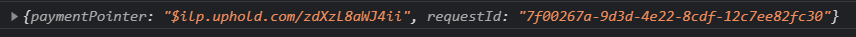
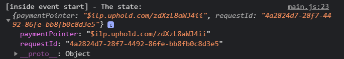

# An overview of the plugin

Let's get started using the Game Web Monetization plugin and see what features are available.

First of all remember that you should have your payment pointer, if you don't have it remember that you have put it in Coil so we can retrieve it from [here](https://coil.com/).

Go to the Coil website and then in **Settings** look for **Payouts** and you will see your payment pointer.


Now what we will do is generate a simple test page so open your favorite code editor (I will use [Visual Studio Code](https://code.visualstudio.com/)), create a folder on the desktop (on wherever you want) and create an **index.html** and a **main.js**, as I have it in my code editor:


Let's go to index.html and create its basic structure by calling **main.js** and defining it as a module to prepare everything, just like this model:

```html
<!DOCTYPE html>
<html lang="en">
<head>
    <meta charset="UTF-8">
    <meta http-equiv="X-UA-Compatible" content="IE=edge">
    <meta name="viewport" content="width=device-width, initial-scale=1.0">
    <title>Game Web Monetization</title>
</head>
<body>
    
    <script src="./main.js" type="module"></script>
</body>
</html>
```

Now, we will download the plugin from [here](https://github.com/photonstorm/gamewebmonetization/blob/main/plugin/dist/GameWebMonetization.js) and put it in the project (right at the root).


As we already have the module type set, we will be able to load our plugin from main.js, we will use imports although you could also use the es5 version and load it through the script tag and it should work the same.

Let's go to **main.js** and import our plugin:

```javascript
import { GameWebMonetization } from './GameWebMonetization.js';
```

Now in the next line to prepare the plugin you have to instantiate it by assigning it a variable and placing our payment pointer, it should look like this (remember to put your payment pointer):

```javascript
const gameWebMonetization = new GameWebMonetization({
    paymentPointer: '$ilp.uphold.com/zdXzL8aWJ4ii'
});

```

What we have done so far is to prepare the plugin, it has been instantiated and a payment pointer has been assigned, now we have to start it.

We open our **index.html** in the browser (I'll use **Visual Studio Code** and the **Live Server** extension).

Once opened, it will still have to appear that the site is not monetizable and this is because we have prepared the plugin but have not started monetization.


Let's go back to our **main.js** and now we can start the monetization with the **start()** method, it should look like this:

```javascript
import { GameWebMonetization } from './GameWebMonetization.js';
 
const gameWebMonetization = new GameWebMonetization({
    paymentPointer: '$ilp.uphold.com/zdXzL8aWJ4ii'
});
 
gameWebMonetization.start();
```

Now if we go back to the web and update we will see that our site begins to monetize:


Congratulations, only with that configuration you can monetize at all times but you also have to give some reward to the user so for that we have different methods and properties that will help us to know the status of the plugin and we are going to see some.

## Methods, properties and events

The plugin has different events such as: **start**, **stop**, **pending** and **progress**.

<br />

### The start event.

The event is emitted when Web Monetization API is sucessfully started.

To use it, we simply put the event on listening using the **.on()** listener method and assigning the event to listen **GameWebMnetizationo.START**, put the following just below the **.start()** method before created.

```javascript
gameWebMonetization.on(GameWebMonetization.START, (event) => {
    // Here your code
});
```

Where it says **Here your code** we will put a console.log of the argument that the event sends us, and then we will go to our browser console and observe what it has returned to us, the code should look like this:

```javascript
gameWebMonetization.on(GameWebMonetization.START, (event) => {
    // Here your code
    console.log(event);
});
```
As a result in console we should have something like this:



property | details
--- | ---
`paymentPointer` | Your payment account URL. The same value is used as the content in your tag.
`requestId` | This value is identical to the session ID/monetization ID (UUID v4) generated by the user agent .

<br />

If you notice  we have **paymentPointer** and a **requestId**


We will need this event when we want to know that the game is being monetized and to be able to show/hide (like a message) something dynamically.
 
Now you have to be careful because every time you change the browser window the monetization stops and you will have another emission of the start event.

So now you know, use this event to know when the monetization starts.

<br />

### isMonetized.

In the course of your game, you may only be interested in knowing if it is being monetized or not in a not so dynamic way and to know this only when a scene or a certain game starts, so for that we have the **.isMonetized** property that it is independent of the event and it only returns a boolean that we will only know in what state it is when this property is called.

Now we will do a **console.log** before starting the monetization and then another **console.log** inside the event to see its changes, put the following code:

```javascript
var gameWebMonetization = new GameWebMonetization({
    paymentPointer: '$ilp.uphold.com/zdXzL8aWJ4ii'
});

// New code:
console.log('Is monetized? ', gameWebMonetization.isMonetized);

gameWebMonetization.start();

// New code:
gameWebMonetization.on(GameWebMonetization.START, (event) => {
    console.log('[inside event start] - Is monetized? ', gameWebMonetization.isMonetized);
});
```

Now if we go to the browser console we can see that before the monetization starts and the event is generated we will have a **false** and then **true** (true is when it is being monetized). 


Now, call **.isMonetized** in any part of your game where you want to check the status at that moment and give a prize or benefit to the user.

<br />

### Know the current state

The plugin goes through different states, namely: **started**, **stopped** or **pending**.

To know the state, just call the **.state** property, let's do the same as we did with **isMonetized** but changing it to **state**, you should have the following code:

```javascript
import { GameWebMonetization } from './GameWebMonetization.js';
 
var gameWebMonetization = new GameWebMonetization({
    paymentPointer: '$ilp.uphold.com/zdXzL8aWJ4ii'
});

// New code
console.log('The state: ', gameWebMonetization.state);
 
gameWebMonetization.start();
 
gameWebMonetization.on(GameWebMonetization.START, (event) => {
    // New code
    console.log('[inside event start] - The state: ', gameWebMonetization.state);
});

```

And in the console you will see the following:


### The pending event

The event is emitted while the Web Monetization API is preparing to start to monetize your site.

We will copy the start event that we have listening and its console.log but changing the word **start** to **pending**, you should now have this code:

```javascript
import { GameWebMonetization } from './GameWebMonetization.js';
 
var gameWebMonetization = new GameWebMonetization({
    paymentPointer: '$ilp.uphold.com/zdXzL8aWJ4ii'
});
 
console.log('The state: ', gameWebMonetization.state);
 
gameWebMonetization.start();

// New code
gameWebMonetization.on(GameWebMonetization.PENDING, (event) => {
    console.log('[inside event pending] - The state: ', gameWebMonetization.state);
});
 
gameWebMonetization.on(GameWebMonetization.START, (event) => {
    console.log('[inside event start] - The state: ', gameWebMonetization.state);
});
```

Now we go to the browser and we will see the following:


If you look now we already get the pending status. In event we receive the same as in the **start** event so it is not necessary to see what is in there.

### The progress event

This event is emitted when the Web Monetization API receives a progress event.
We will use the following code to know the progress:

```javascript
gameWebMonetization.on(GameWebMonetization.PROGRESS, (event) => {
    console.log('Progress: ', event);
});
```

This time we have used a console.log to event to see what it is returning to us, if we open the console we will see the following:


property | details
--- | ---
`paymentPointer` | Your payment account URL. The same value is used as the content in your tag.
`requestId` | This value is identical to the session ID/monetization ID (UUID v4) generated by the user agent.
`amount` | The destination amount received as specified in the Interledger protocol (ILP) packet.
`assetCode` | The code (typically three characters) identifying the amount's unit. A unit, for example, could be a currency (USD, XRP). 
`assetScale` | The number of places past the decimal for the amount. For example, if you have USD with an asset scale of two, then the minimum divisible unit is cents.
`receipt` | base64-encoded STREAM receipt issued by the Web Monetization receiver to the Web Monetization provider as proof of the total amount received in the stream.
`totalAmount` | the sum of what has been received with the current paymentPointer, if the paymentPointer is changed this amount will be reset

<br />

This will help us to know the progress of the monetization at all times, this event is emitted many times so be careful with it.

If you look the most remarkable thing would be to see the **assetCode** and **totalAmount**.

The assetCode is the type of currency we are receiving, in this case it is the XRP cryptocurrency (don't worry, your wallet will convert the coins automatically).

The **totalAmount** is the amount of income that we are obtaining by a user (this counter is reset every time the user restarts the game).

<br />

### The stop event

And finally we also have the stop event, so copy the start event and change start to stop, it should look like this:

```javascript
gameWebMonetization.on(GameWebMonetization.STOP, (event) => {
    console.log('[inside event stop] - The state: ', gameWebMonetization.state);
});

```

Once the event is set, it will not be emitted until we call the **stop()** method, now what we will do is call that method after a while.
Use **setTimeout** with five seconds and call the **stop()** method, you should have the following code:
 
```javascript
gameWebMonetization.on(GameWebMonetization.STOP, (receive) => {
    console.log('[inside event stop] - The state: ', gameWebMonetization.state);
});
 
setTimeout(() => {
    gameWebMonetization.stop();
}, 5000);
```

Now, if you go to the console you will see that the progress event is emitted and then the plugin stops and emits the stop event:


You can use the stop event to know when your game stops, but remember that this event will also be emitted when you change windows since the monetization will stop.

<br />

## Divide the income

With the plugin it is possible to divide the income for this we use probabilistic income distribution, we recommend that you see this link for more details [here](https://webmonetization.org/docs/probabilistic-rev-sharing).

When a user accesses your game the plugin is able to select a paymentPointer depending on a weight that we assign, the global weight it is not must exceed 100% and you can decide how to distribute that weight, if you want you can, for example, put a collaborator a weight of 40 and you get 60 and thus you have a better chance that your paymentPointer will come out 60% more than that of your partner who overall will only come out 40%.

Once you have configured the multiple paymentPointer the plugin will internally select one randomly (but taking into account the weight) and it will continue to work the same as it has been taught in this tutorial.

To configure multiple payment points you can do it by modifying the configuration when we instantiate the plugin, we will add an array with multiple payment pointer, as is the code:

```javascript
const gameWebMonetization = new GameWebMonetization([
    {
        paymentPointer: '$ilp.uphold.com/zdXzL8aWJ4ii',
        weight: 60
    },
    {
        paymentPointer: '$ilp.uphold.com/ziW6E7iwKUkp',
        weight: 40
    }
]);

```

Now if we go to the start event and do a console.log when we receive, we can verify that if we update the browser many times, the payment pointer will change and that is due to the weight we have assigned:

```javascript
gameWebMonetization.on(GameWebMonetization.START, (event) => {
    console.log('[inside event start] - The state: ', event);
});
```

When updating many times you will see that the payment pointer is changed:




<br />

If it is a bit difficult to know who owns each payment pointer, we can optionally pass the pointerName property in the configuration like this:

```javascript
const gameWebMonetization = new GameWebMonetization([
    {
        paymentPointer: '$ilp.uphold.com/zdXzL8aWJ4ii',
        weight: 60,
        pointerName: "Bob"
    },
    {
        paymentPointer: '$ilp.uphold.com/ziW6E7iwKUkp',
        weight: 40,
        pointerName: "Alice"
    }
]);

```

To know the name we simply access the pointerName property, we will do it within the start event (for example) in this way:

```javascript
gameWebMonetization.on(GameWebMonetization.START, (event) => {
    console.log('[inside event start] - The state: ', gameWebMonetization.pointerName);
});
```

We go to the browser, refresh it and look at the name:


And if you update several times you will see that the name is changed:


<br />

### Change the paymentPointer

To change the paymentPointer we have a method called **.changePaymentPointer()**.

To use it you can simply call it without any problems and assign the new paymentPointer like this:

```javascript
gameWebMonetization.changePaymentPointer({
    paymentPointer: '$ilp.uphold.com/ziW6E7iwKUkp',
    weight: 40,
    pointerName: "Alice"
});

```

Remember that the method is part of the **GameWebMonetization** instance and is not a static method.

Now, **changePaymentPointer()** only prepares the change but does not make it, for the change to be effective you will have to stop the monetization with **.stop()** and then resume it with **.start()**.

Well, you already have everything you need to monetize your games, see you in the next tutorial.