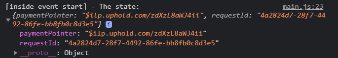
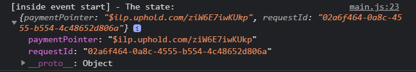
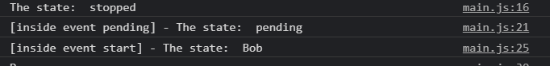
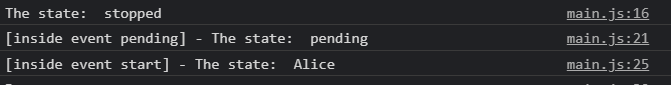

Using the Game Web Monetization Plugin it is possible to divide the income your game receives between multiple Payment Pointers. The Web Moneitzation API cannot do this directly, so instead it uses a process known as probabilistic income distribution. You can [read more](https://webmonetization.org/docs/probabilistic-rev-sharing) about this concept on the Web Monetization web site.

As you've seen in previous tutorials you need to pass a configuration object to the plugin that contains a `paymentPointer`. This is the address of the wallet that will receive the payments:

```javascript
const gameWebMonetization = new GameWebMonetization({
    paymentPointer: '$ilp.uphold.com/zdXzL8aWJ4ii'
});
```

However, you can also provide an array of configuration objects and assign each of them a `weight` value, such as this:

```javascript
const gameWebMonetization = new GameWebMonetization([
    {
        paymentPointer: '$ilp.uphold.com/zdXzL8aWJ4ii',
        weight: 60
    },
    {
        paymentPointer: '$ilp.uphold.com/ziW6E7iwKUkp',
        weight: 40
    }
]);
```

The `weight` properties control the percentage chance of that Payment Provider being selected by the plugin. Therefore, the total `weight` values when all added together must not exceed 100.

It's up to you how the weights are distributed. For example, you may wish to evenly split the weights between all team members of the game. Or, perhaps you give the developer a 70% weight and the artist a 30% weight? It's entirely up to you. The `weight` value given directly controls the chance of that wallet being selected when the Web Monetization API starts.

Here is a complete `main.js` test for you to see this in action:

```javascript
import { GameWebMonetization } from './GameWebMonetization.js';

const gameWebMonetization = new GameWebMonetization([
    {
        paymentPointer: '$ilp.uphold.com/zdXzL8aWJ4ii',
        weight: 60
    },
    {
        paymentPointer: '$ilp.uphold.com/ziW6E7iwKUkp',
        weight: 40
    }
]);

gameWebMonetization.on(GameWebMonetization.START, (event) => {
    console.log('[inside event start] - The state: ', event);
});

gameWebMonetization.start();
```

If you run this test many times you will see that the Payment Pointer is changed in the console:




If it is difficult to know who owns each payment pointer, we can optionally pass the `pointerName` property in the configuration like this:

```javascript
const gameWebMonetization = new GameWebMonetization([
    {
        paymentPointer: '$ilp.uphold.com/zdXzL8aWJ4ii',
        weight: 60,
        pointerName: "Bob"
    },
    {
        paymentPointer: '$ilp.uphold.com/ziW6E7iwKUkp',
        weight: 40,
        pointerName: "Alice"
    }
]);
```

To retrieve the name we simply access the `pointerName` property that the plugin offers us:

```javascript
console.log('Paying into the wallet of', gameWebMonetization.pointerName);
```

If we go to the browser and refresh it, we can see the name being displayed:



And if you update several times you will see that the name is changed based on the weight values:



Even if you are the only person involved in making your game you can still use this system to distribute payments to your digital wallets with different currencies set in them. Just remember that once the Payment Povider has been selected it will remain active for the entire game session.
