We learned how to use test the different features of the plugin in the previous part of this tutorial series. If you missed that, please re-read it first. Now, it's time to use it in a proper Phaser 3 game. In this tutorial we're going to take a ready-made Phaser game and work through implementing the Game Web Monetization plugin into it.

## Download the Game Files

To get started, please download or check-out the [Game Web Monetization GitHub repo](https://github.com/photonstorm/gamewebmonetization). If you're familiar with using git, then you can checkout the repo via http:

```
https://github.com/photonstorm/gamewebmonetization.git
```

Or ssh:

```
git@github.com:photonstorm/gamewebmonetization.git
```

If you'd prefer, you can [download a zip file](https://github.com/photonstorm/gamewebmonetization/archive/refs/heads/main.zip) of the whole repo

Once the files are on your computer you will find the sample game in the `tutorial/examples/3Candies` folder.

Drag and drop the folder into Visual Studio Code or your editor of choice so you can easily look at the source code of the various files.

## Project Structure

Inside the game folder we can see an `index.html` file, along with `src` and `phaser` folders. Everything is already preconfigured to run, so let's dive into the `src` folder.

Within `src/plugins` you'll see a folder with the Game Web Monetization plugin inside it.

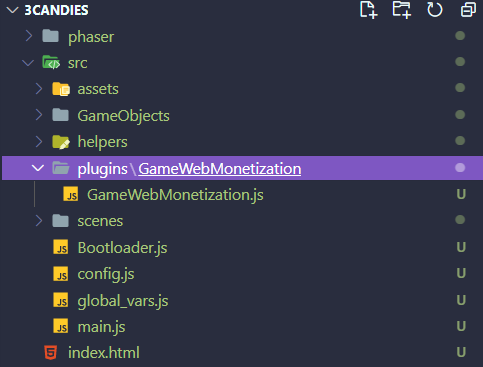

This game is split into 4 Phaser Scenes:

1. **Intro** - The intro message and plugin check.
2. **BackgroundScene** - The scrolling background behind the game.
3. **Menu** - The Main Menu.
4. **MainScene** - The Game itself.

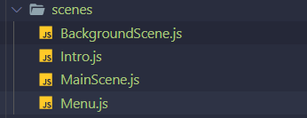

There is also another important file: `src/global_vars.js`:

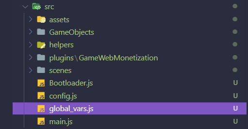

This file contains all of the variables you can easily change to modify the game itself. If you open the file into your editor you'll see a commented section where the plugin configuration is stored.

You'll also see an object called `background_selected`. Within this the `active` property is set to `normal`. This controls if the game is running in Web Monetized mode, or not and is used by the **Menu** and **BackgroundScene** to display different game backgrounds.

You can edit it from `normal` to `premium` to see the difference when you play the game, without having to have monetization active. But please make sure you set it back to `normal` before carrying on with this tutorial.

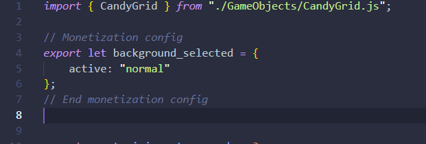

## Adding Monetized Benefits

We're going to add the following benefits to the player if they Web Monetize our game:

* A "Thank You!" intro message.
* The option to change the background for a more colorful one.
* They'll gain 1 extra life during play.

Run the game by opening the `index.html` with your web server of choice. As before, we'll use the VS Code Live Server extension for this. Open the browser and you should see that the game has started:

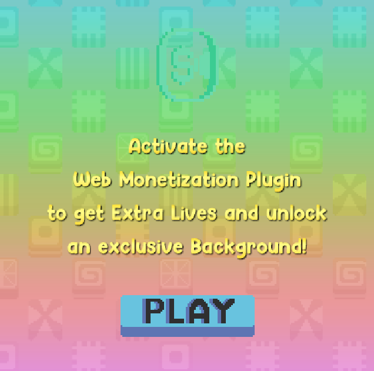

We've added an intro screen to our game. This is because it can take a few seconds for the Web Monetization API to negotiate, which is plenty of time to show them a short message about the benefits of it.

### Importing the Plugin

The time has come to put the plugin in our game.

Edit the `global_vars.js` file and import the plugin at the top of the file and then create an instance of the plugin:

```js
import { GameWebMonetization } from "./plugins/GameWebMonetization/GameWebMonetization.js";

// Monetization config
export const gamewebmonetization = new GameWebMonetization({
    paymentPointer: '$ilp.uphold.com/zdXzL8aWJ4ii'
});
```

Remember to add the above code directly under the `CandyGrid` import statement.

The code you added should look like this:

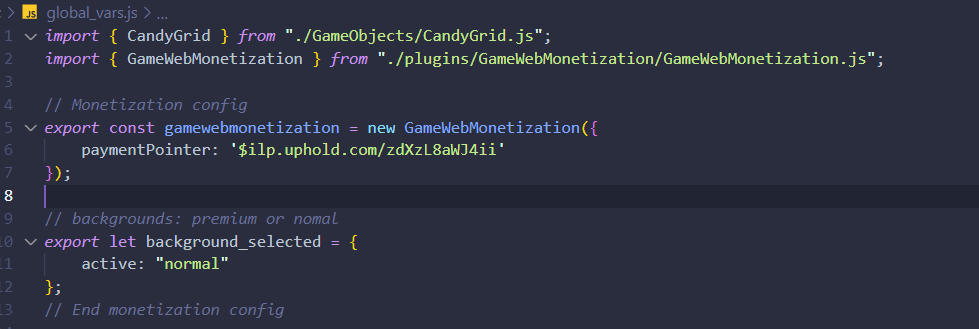

The plugin has been imported and created, with our Payment Pointer set. Now we need to start the plugin in the `scenes/Intro.js` file.

Edit `Intro.js` and import the plugin instance, so we can use it:

```javascript
import { gamewebmonetization } from "../global_vars.js";
```

As you learned in the previous tutorial, the plugin needs its `start` method called before it'll do anything. We will do this in the Scene `init` method.

Add the following line of code to the start of `init`:

```js
gamewebmonetization.start();
```

So it looks like this:

```js
    init ()
    {
        gamewebmonetization.start();

        this.cameras.main.fadeIn(1000, 0, 0, 0);

        this.changingScene = true;
```

With the `import` and the `start()` call your code should now look like this:

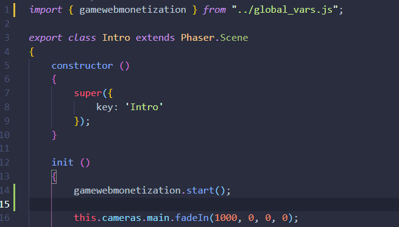

Restart the game in the browser and if you have the Coil extension working you'll see the game is monetized:

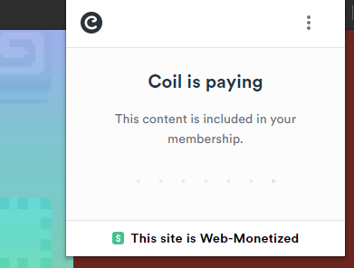

## Adding the Player Benefits

Starting monetization is all good and well, but now we really ought to start giving some benefits to the players that are supporting us. First, let's show a "Thank You" message to them.

In the `assets` folder you'll see two PNGs: `intro.png` and `introthanks.png`:

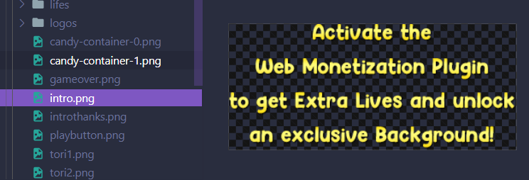
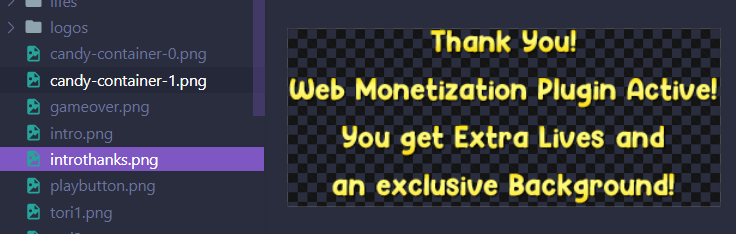

We will edit the code to display the correct one, based on the status of the API.

Back inside the `Intro.js` file, scroll down to inside the `create` method where the `intro` image is added:

```js
const intro = this.add.image(x, 240, 'intro');
```

We're going to use the plugins `START` event to change this texture. We have already loaded all the images required, so all we need is an event listener and to act on it accordingly:

```javascript
const intro = this.add.image(x, 240, 'intro');

// Plugin here
gamewebmonetization.on("start", () => {
    intro.setTexture('introthanks');
});
```

Let's go back to our game and see what happens:


When the event fires, the intro texture is changed to the "Thank You!" version. Now let's give them a choice of backgrounds.

### Changing to the Premium Background

When you go to the Main Menu in the game you'll see two buttons at the bottom. These allow the player to toggle between the Standard and Premium backgrounds. Only if they are Web Monetized can they pick the Premium background. If they aren't, we'll show them an alert message instead.

You may remember from Part 3 of the tutorial that the plugin offers a boolean property called `isMonetized`. We can read this to know if we should enable both buttons for the player, or not.

As with the other Scenes, we need to import the plugin and we're also going to import the `background_selected` object. This will store our choice of background from the buttons:

```javascript
import { background_selected, gamewebmonetization } from "../global_vars.js";
```

We can now read the `isMonetized` boolean and will give the Premium Background button a slight alpha if they are not monetized. Add the following after the line `premiumBackgroundButton.setInteractive({ useHandCursor: true });`:


```js
if (!gamewebmonetization.isMonetized)
{
    premiumBackgroundButton.setAlpha(0.9);
}
```

The final change to make is to fill-in the Premium Button `POINTER_DOWN` handler. Currently it looks like this:

```js
premiumBackgroundButton.on('pointerdown', (pointer, x, y, event) => {

    this.popfx.play();

    event.stopPropagation();

});
```

When they click all it does currently is play a sound effect. We're going to check the monetization state and either update the button, or show an alert. Change the above code to the following:

```js
premiumBackgroundButton.on('pointerdown', (pointer, x, y, event) => {

    this.popfx.play();

    if (gamewebmonetization.isMonetized)
    {
        this.isPremium = true;

        normalBackgroundButton.setTexture('normal_background-button');
        premiumBackgroundButton.setTexture('premium_background-button-selected');
    }
    else
    {
        alert('You need the plugin!');
    }

    event.stopPropagation();

});
```

Now if you play the game again, you will see that you have the option to change the background by clicking the two buttons:


### Extra Life

Our final player benefit is to give them an extra life.

Open the `scenes/MainScene.js` file in your editor. In the `create` method you will see the following code:

```javascript
// Lifes
this.lifes = new Lifes(this, this.isMonetized);
```

You can see that when the `Lifes` Game Object is created, it accepts the `isMonetized` boolean as a parameter. Instead of passing this value, you could pass `true` or `false` instead to test this out for yourself.

Go to the `init` method and change this line:

```js
this.isMonetized = false;
```

To this:

```js
this.isMonetized = gamewebmonetization.isMonetized;
```

With this change in, the Main Game will now detect if the API is monetized or not:

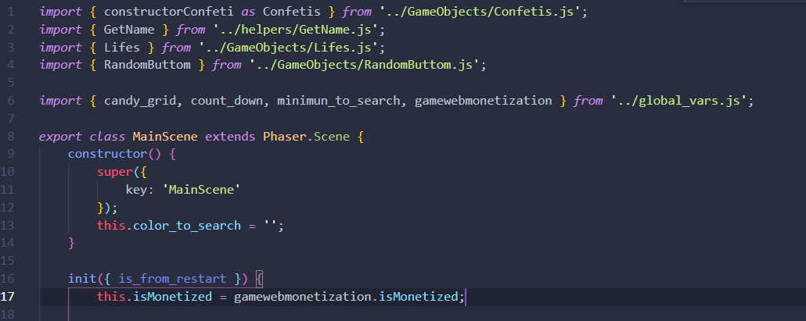

If you start the game you'll see that now you have 3 lives and one of them is gold. This is the bonus life we gave to the player:


As you have seen there are many possibilities when it comes to using the Game Web Monetization plugin. We've just touched upon a few ideas here, but it really is endless how you wish to reward them. Perhaps you may even consider displaying how much money they have sent to you in the actual game, or the larger the amount, the more benefits they get? It's truly up to you.
