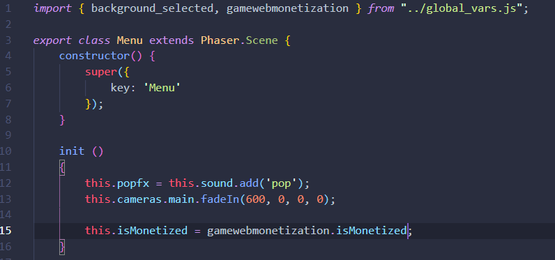

# How to use the plugin in a real game

### Conociendo el proyecto

The time has come to implement the plugin within our game.

Download the test game in the following repository [here](https://github.com/photonstorm/gamewebmonetization) and within that repository you will find the game in the following path: **tutorial/examples/3Candies**.

Copy the folder anywhere you want and drag and drop the folder into your Visual Studio Code or your favorite text editor.

Inside the game folder we can see an **index.htm** a **src** and the folder where **phaser** is hosted, everything is already preconfigured so we are only interested in going to **src**.

Inside **src** we have a folder called ** plugins ** and that is where we will put our plugin, in the game we already have it downloaded so you will not have to worry about putting it back, anyway if you need to download the plugin remember you have it in this link: [here](https://github.com/photonstorm/gamewebmonetization/blob/main/plugin/dist/GameWebMonetization.js)


Now the next most important thing we have will be the scenes, as you will see we have 4 scenes, **Intro**, **BackgroundScene**, **Menu** and **MainScene** which is the main scene of the game.


Another thing you should pay attention to is the file that manages the global variables, this file is inside **src**.


If you open the file you will see a commented section where we will put our plugin configuration, but while you can see that we have defined a **background_selected**, this variable will serve to activate or deactivate the premium menu since it will be used by the scenes **Menu** and **BackgroundScene**.
You can play a bit and change normal to premium, and watch the changes, but please return it to "normal".


The game is complete and ready to grant benefits to the user such as:
* A personalized message to the user if they are monetizing.
* The possibility of changing the background in the game for a more colorful background.
* Have 1 extra life during the game.

Start the game with your favorite server (I will use the Visual Studio Code Live Server extension), go to the browser and you can see that the game has started:


If you notice we have prepared an introduction scene and it is because we will use this scene to start the monetization, the monetization takes a few seconds until it can be resolved if it is being monetized or not and thanks to this scene we can give the plugin time to start monetize the game.

<br />

### Configurando el plugin

The time has come to put the plugin in our game, we go to the **global_vars.js** file and import the plugin (we have seen this in the previous tutorials), after importing we are going to export the variable so that it can be called elsewhere in the game, your code should look like this:


Remember that you will not start monetizing anything yet so we are going to configure that in the **intro.js** file.

Let's go to our scene **Intro**, we import our gamewebmonetization from **global_vars.js** like this:

```javascript
import { gamewebmonetization } from "../global_vars.js";
```

once this is done we are going to start our plugin with **.start()**, we are going to **init ()** and immediately we call the method **.start()** (from gamewebmonetization plugin).


Now if you restart your game you will see that you will already be monetizing.


Monetizing is fine but now we have to start giving bonuses to the user or a message that indicates thanks for supporting us.
In the project we have already prepared a message for that in the form of images with text that are in the **assets** folder, these files are **intro.png** and **introthanks.png**


So what we will do is change those thank you messages in the intro.

In order to change the messages we go down and just below **const intro** (where we add the image to the scene) we are going to use our **start** event and change the texture of our image (remember that we have already loaded all the images of the project for you), surely you already remember what it is, so your code has to look something like this:

```javascript
        const intro = this.add.image(x, 240, 'intro');
 
        // Plugin here
        gamewebmonetization.on("start", () => {
            intro.setTexture("introthanks");
        });
```

Let's go back to our game and see what happens.


Well we already have a personalized thank you message for our user!

<br />

### Cambiando el fondo

Now if we try to go to the menu we have the buttons to change the background, if we click on the premium background we will see that we get an alert that it is necessary to have the Coil extension, so now we are going to add that exclusive background to the user.

The funds exchange system is already fully implemented, if you look if you go to the **Menu.js** file you will see that inside **init ()** you have a variable called **this.isMonetized = false** and If you analyze what it does a little further down, you will see that it helps us to manage the background thanks to **background_selected.active** that is declared in **global_var.js** once one button or another is pressed, the background will be changed active and it will be set to normal or premium and thanks to this then **BackgroundScene.js** will automatically know which background to use.

Well, inside **Menu.js** we are only going to use the **.isMonetized** method, so remember to import the instance of our plugin:

```javascript
import { background_selected, gamewebmonetization } from "../global_vars.js";
```

So assign **this.isMonetized** to gamewebmonetization.isMonetized and automatically if you change the state of the button you will see that it will let you change the background and you can play with the funds you want, your code should be like this:



Now if you try to play again, you will see that you already have the option to change the background.


### Vidas extras

Now finally we are going to make the user have an exclusive extra life, go to the main scene **MainScene.js** and if you look closely we also have the variable called **this.isMonetized** but if you go down to the create method you will see this line:

```javascript
        // Lifes
        this.lifes = new Lifes(this, this.isMonetized);
```

En la instanciación de las vidas si te fijas le estamos pasando **this.isMonetized**, acá perfectamente podríamos poner true o false, juega un poco con eso y prueba el juego, pero recuerda dejar **this.isMonetized** como estaba antes.

Let's go to the **init ()** method and reassign **this.isMonetized** as we did with the **Menu**, remember to import **gamewebmonetization**, it should look like this:


If you start the game you will see that now you will have 3 lives and one of them is gold, therefore it is the extra life that we give to the user.


As you have seen there are many possibilities when it comes to using the monetization plugin and as we have mentioned before it all depends on what you want to give the user.