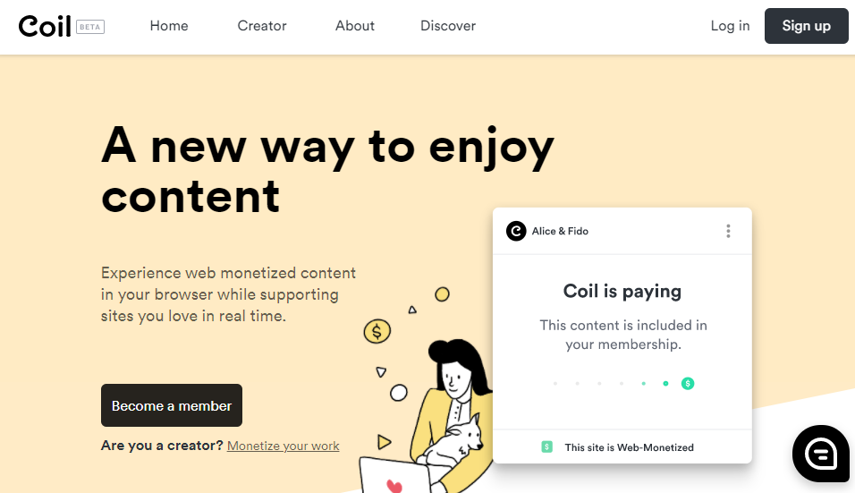
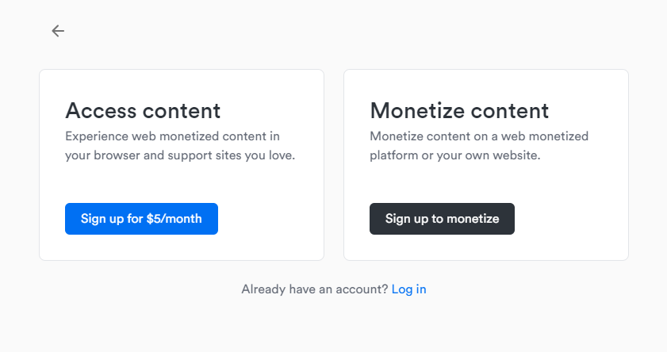
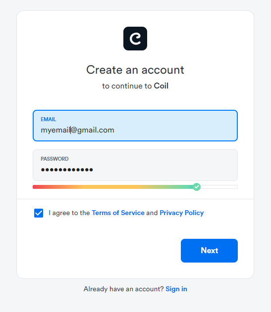
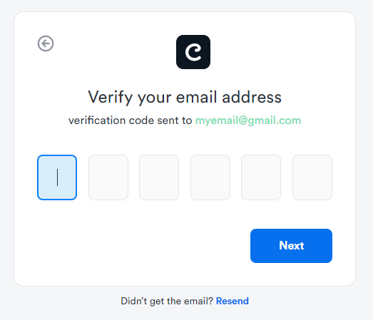
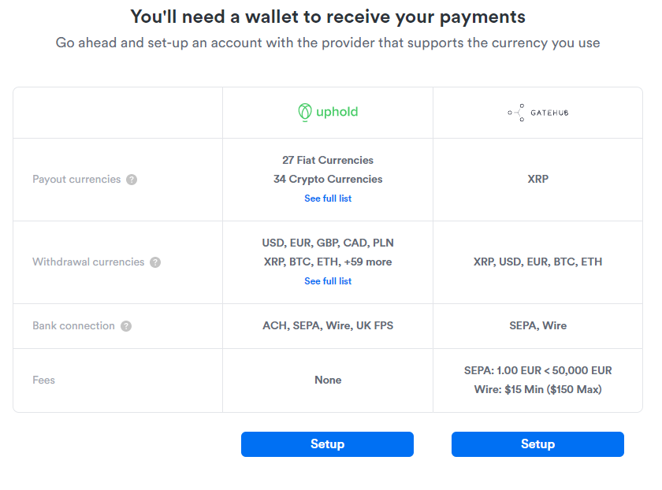
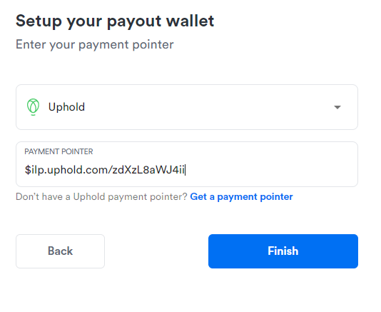
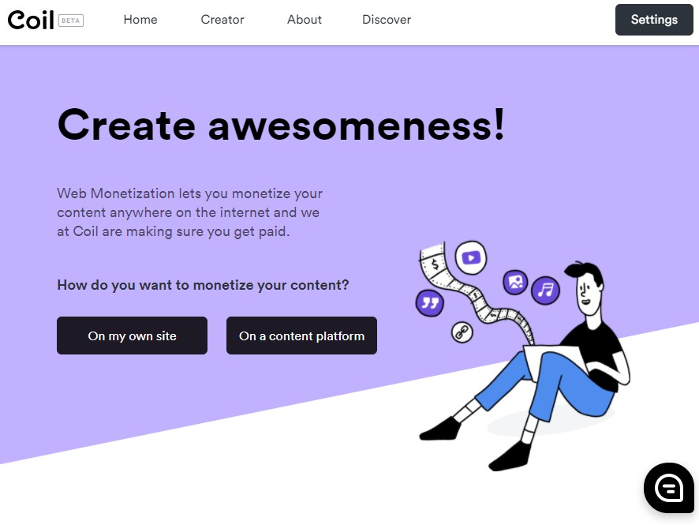
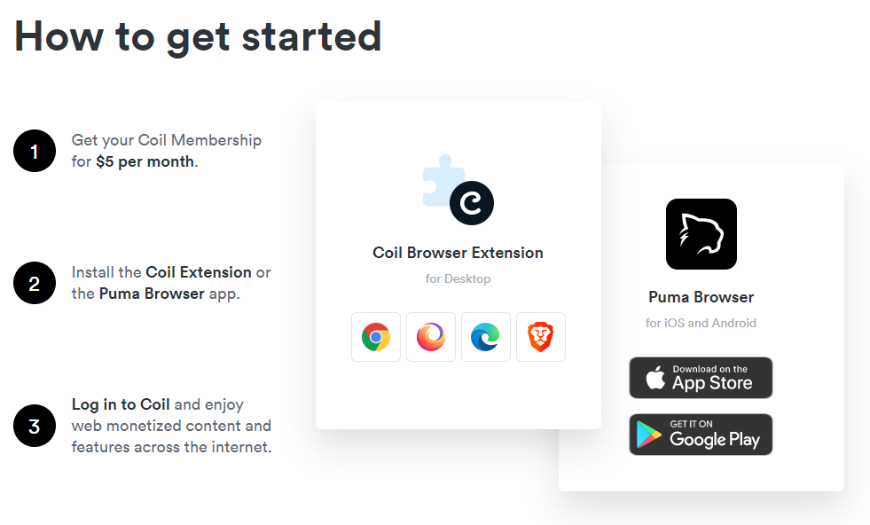
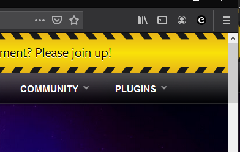
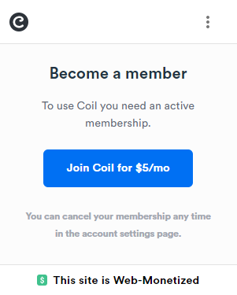

# Coil y Uphold

### Coil

Como hemos mencionado en el capítulo previo el usuario necesita un proveedor para que el pueda ingresar dinero y que este se reparta automáticamente por todas las páginas visitadas (quieres saber más sobre cómo se reparte el dinero: clica [aqí](https://help.coil.com/docs/general-info/intro-to-coil/index.html#how-is-coil-different-from-other-membership-services-like-patreon-and-flattr))j. Actualmente como proveedor podremos usar a Coil así que tendrás que registrarte en la página oficial y asignar tu payment pointer para poder probar que todo esté funcionando correctamente.

- Ve a la página oficial de Coil [aquí](https://coil.com/) y crea una cuenta clicando en **Sing up**

- Selecciona: Monetize Content (Sign up to monetize)

- Rellena tus datos correctamente

- Ve a tu correo e ingresa el código de verificación

### Uphold

Una vez ingresado el código ahora necesitamos crear nuestra cartera/wallet para recibir los pagos, la elección acá es tuya pero nos resultó más sencillo usar Uphold y la validación del usuario es más fácil y rápida, además que tiene muchas monedas disponibles, así que ahora hay que crear una cuenta en uphold pero antes recuerda lo siguiente: Coil es usado para distribuir el dinero que ingrese el usuario pero como desarrollador te interesa saber que todo esté funcionando así que haremos pruebas de monetización pero lo más importante como desarrollador es generar tu cartera y obtener el payment pointer, así que con Uphold ya sería suficiente.

Selecciona Uphold y luego clica en donde dice [Get a payment pointer](https://help.coil.com/docs/monetize/wallets/uphold/index.html) Coil nos mostrará un tutorial bastante bueno de como obtener ese payment pointer que es lo más importante para poder monetizar tu contenido ya que gracias a ese payment pointer podrás recibir el dinero.

A este punto y después de haber creado tu cuenta en Uphold ya deberías tener tu payment pointer y solo queda ponerlo en la configuración de tu cuenta de Coil y clica en: Finish.

Una vez realizado eso ya nos redirige al home.

### Extensión de Coil

Llegó la hora de instalar la extensión de Coil para que podamos hacer las pruebas correctamente.

Clica en donde dice Home o accede a [https://coil.com](https://coil.com) y baja hasta encontrar **Install the Coil Extension**  or **The Puma Browser** app.

Una vez instalada la extensión podemos probar si todo está funcionando.
Podrás ver la extensión en tu barra de extensiones de tu navegador: 

Es probable que necesites convertirte en miembro y pagar 5 dólares la primera vez para realizar estas pruebas.

A este punto si estás en la página oficial de phaser: (https://phaser.io) y clicas el icono de la extensión de Coil podrás ver lo siguiente.

Si eres miembro:

Si no eres miembro probablemente veas esto: 

Y como puedes observar a pesar de que no somos miembros nos aparece en la parte inferior de la extensión que el sitio es monetizable.

Y con todo esto ya tenemos todo preparado para empezar a probar, nos vemos en el siguiente capítulo.
