# Una descripción general del plugin

Vamos a empezar a usar el plugin Game Web Monetization y a ver qué funciones están disponibles. 

Primero que todo recuerda que deberías tener tu payment pointer, si no lo tienes recuerda que lo has puesto en Coil así que lo podremos recuperar de [acá](https://coil.com/).

Ve a la web de Coil y luego en **Settings** busca **Payouts** y verás tu payment pointer.

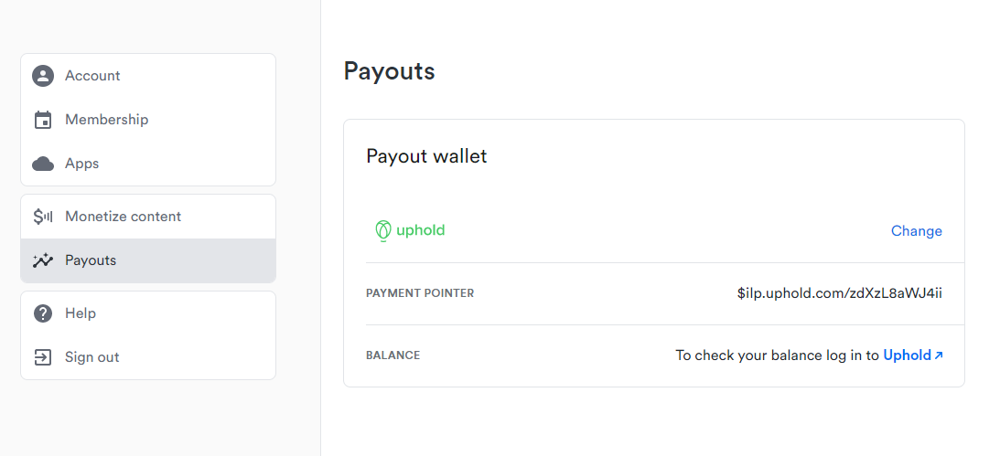

Ahora bien lo que haremos será generar una página simple de pruebas así que abre tu editor de código favorito (yo usaré [Visual Studio Code](https://code.visualstudio.com/)), crea una carpeta en el escritorio (on donde quieras) y crea un **index.html** y un **main.js**, tal cual lo tengo en mi editor de código: 

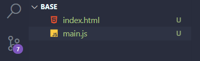

Vamos a index.html y creamos su estructura básica llamando a main.js y definiéndolo como módulo para preparar todo, tal cual este modelo: 

```html
<!DOCTYPE html>
<html lang="en">
<head>
    <meta charset="UTF-8">
    <meta http-equiv="X-UA-Compatible" content="IE=edge">
    <meta name="viewport" content="width=device-width, initial-scale=1.0">
    <title>Game Web Monetization</title>
</head>
<body>
    
    <script src="./main.js" type="module"></script>
</body>
</html>
```

Ahora, bajaremos el plugin [aquí](https://github.com/photonstorm/gamewebmonetization/blob/main/plugin/dist/GameWebMonetization.js) y lo pondremos en el proyecto (justo en la raíz).

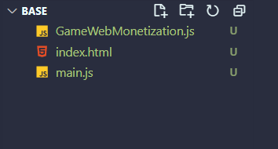

Como ya tenemos puesto el tipo módulo ya podremos cargar nuestro plugin desde main.js, usaremos imports aunque también podrías usar la versión es5 y cargarlo por medio del tag script y tendría que funcionar igual.

Vamos a **main.js** y hacemos import a nuestro plugin:

```javascript
import { GameWebMonetization } from './GameWebMonetization.js';
```

Ahora en la siguiente línea para preparar el plugin hay que instanciarlo asignando una variable y colocando nuestro payment pointer, te tiene que quedar así (recuerda poner tu payment pointer): 
 
```javascript
const gameWebMonetization = new GameWebMonetization({
    paymentPointer: '$ilp.uphold.com/zdXzL8aWJ4ii'
});

```

Lo que hemos hecho hasta el momento es preparar el plugin, se ha instanciado y se ha asignado un payment pointer, ahora hay que iniciarlo. 

Abrimos nuestro **index.html** en el navegador (yo usaré **Visual Studio Code** y la extensión **Live Server**).

Una vez abierto aún te tendrá que salir que el sitio no es monetizable y esto es debido a que hemos preparado el plugin pero no hemos iniciado la monetización.

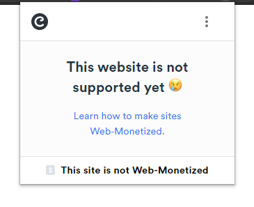

Volvamos a nuestro **main.js** y ahora iniciamos la monetización con el método **start()**, te tendría que quedar así:

```javascript
import { GameWebMonetization } from './GameWebMonetization.js';
 
const gameWebMonetization = new GameWebMonetization({
    paymentPointer: '$ilp.uphold.com/zdXzL8aWJ4ii'
});
 
gameWebMonetization.start();
```

Ahora si volvemos a la web y actualizamos veremos que nuestro sitio empieza a monetizar: 

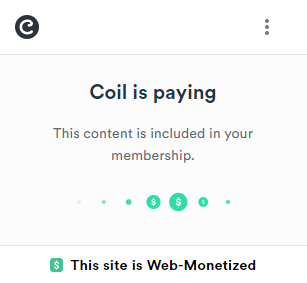

Felicidades, ya solo con esa configuración puedes monetizar en todo momento pero también hay que darle alguna recompensa al usuario así que para eso tenemos diferentes métodos y propiedades que nos ayudarán a conocer el estado del plugin y vamos a ver algunas.

## Métodos, eventos y propiedades

El plugin tiene diferentes eventos como son: **start**, **stop**, **pending** y **progress**.

<br />

### Evento start.

Este evento es emitido cuando la API de monetización ha iniciado correctamente y se empieza a monetizar. 
Para usarlo simplemente ponemos en escucha el evento usando el método de escucha **.on()** y asignando el evento a escuchar **GameWebMnetizationo.START**, pon lo siguiente justo debajo del método **.start()** antes creado.

```javascript
gameWebMonetization.on(GameWebMonetization.START, (event) => {
    // Here your code
});
```

En donde dice **Here your code** pondremos un console.log del argumento que nos manda el evento, y luego iremos a nuestra consola del navegador y observamos lo que nos ha devuelto, el código debería quedarte de esta manera:

```javascript
gameWebMonetization.on(GameWebMonetization.START, (event) => {
    // Here your code
    console.log(event);
});
```

Como resultado en consola deberíamos tener algo así: 

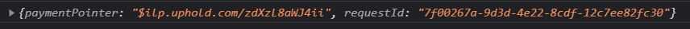

property | details
--- | ---
`paymentPointer` | Tu payment pointer. Es el mismo valor que has usado en la configuración.
`requestId` | Este valor es un ID de dessión o ID de monetización (UUID v4) generado por el agente de usuario.

<br />

Si te fijas tenemos nuestro **paymentPointer** y un **requestId**.

Necesitaremos este evento cuando queremos saber que se está monetizando el juego y poder mostrar u ocultar algo de manera dinámica (como un mensaje).
 
Ahora bien hay que tener cuidado porque cada vez que cambias de ventana del navegador la monetización se detiene y tendrás otra emisión del evento start.

Así que ya sabes, usa este evento para saber cuando se inicia la monetización.

<br />

### Propiedad isMonetized.

En el transcurso de tu juego a lo mejor solo te interesa conocer si se está monetizando o no de manera no tan dinámica y saber esto solo cuando se inicie una escena o cierta partida así que para eso tenemos la propiedad **.isMonetized** que es independiente del evento y que solo nos devuelve un booleano que solo conoceremos en qué estado está cuando esta propiedad es llamada.

Ahora le haremos un **console.log** antes de iniciar la monetización y luego otro **console.log** dentro del evento para ver sus cambios, pon el siguiente código: 

```javascript
var gameWebMonetization = new GameWebMonetization({
    paymentPointer: '$ilp.uphold.com/zdXzL8aWJ4ii'
});

// New code:
console.log('Is monetized? ', gameWebMonetization.isMonetized);

gameWebMonetization.start();

// New code:
gameWebMonetization.on(GameWebMonetization.START, (event) => {
    console.log('[inside event start] - Is monetized? ', gameWebMonetization.isMonetized);
});
```

Ahora si vamos a la consola del navegador podremos observar que antes de que se inicie la monetización y se genere el evento tendremos un **false** y luego **true** (true es cuando se está monetizando).

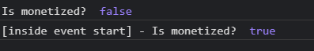

Ahora bien, llama a .isMonetized en cualquier parte de tu juego en donde quieras comprobar el estado en ese momento y dar algún premio o beneficio al usuario.

<br />

### Conocer el estado actual del plugin

El plugin pasa por distintos estados a saber: **started**, **stopped** o **pending**.

Para saber el estado basta con llamar a la propiedad **.state**, hagamos lo mismo que hicimos con isMonetized pero cambiandolo por **state**, te tendría que quedar el siguiente código: 

```javascript
import { GameWebMonetization } from './GameWebMonetization.js';
 
var gameWebMonetization = new GameWebMonetization({
    paymentPointer: '$ilp.uphold.com/zdXzL8aWJ4ii'
});

// New code
console.log('The state: ', gameWebMonetization.state);
 
gameWebMonetization.start();
 
gameWebMonetization.on(GameWebMonetization.START, (event) => {
    // New code
    console.log('[inside event start] - The state: ', gameWebMonetization.state);
});

```

Y en la consola podrás ver lo siguiente: 

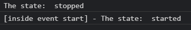

### Evento pending

Este evento o estado emitido cuando el API de webmonetization se prepara para iniciar la monetization.
Copiaremos el evento start que tenemos en escucha y su console.log pero cambiando la palabra start por pending, tendrías que tener ahora este código: 


```javascript
import { GameWebMonetization } from './GameWebMonetization.js';
 
var gameWebMonetization = new GameWebMonetization({
    paymentPointer: '$ilp.uphold.com/zdXzL8aWJ4ii'
});
 
console.log('The state: ', gameWebMonetization.state);
 
gameWebMonetization.start();

// New code
gameWebMonetization.on(GameWebMonetization.PENDING, (event) => {
    console.log('[inside event pending] - The state: ', gameWebMonetization.state);
});
 
gameWebMonetization.on(GameWebMonetization.START, (event) => {
    console.log('[inside event start] - The state: ', gameWebMonetization.state);
});
```

Ahora vamos al navegador y veremos lo siguiente:

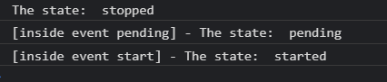

Si te fijas ahora ya obtenemos el estado pendiente. En event recibimos lo mismo que en el evento **start** así que no hace falta ver que hay ahí dentro.

### Evento progress
Este evento se emite cuando hay un flujo de monetización constante.
Usaremos el siguiente código para saber el progreso: 

```javascript
gameWebMonetization.on(GameWebMonetization.PROGRESS, (event) => {
    console.log('Progress: ', event);
});
```

Esta vez hemos usado un console.log a event para ver que nos está devolviendo, si abrimos la consola veremos lo siguiente: 

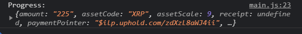

property | details
--- | ---
`paymentPointer` | Tu payment pointer. Es el mismo valor que has usado en la configuración.
`requestId` | Este valor es un ID de dessión o ID de monetización (UUID v4) generado por el agente de usuario.
`amount` | La cantidad de destino recibida según se especifica en el paquete del protcolo Interledger (ILP).
`assetCode` | El código (normalmente tres caracteres) que identifica el tipo de unidad. Una unidad, por ejemplo podría ser una moneda (USD, XRP). 
`assetScale` | El número de lugares después del decimal para la cantidad. Por ejemplo, si tiene USD con una escala de activos de dos, entonces la unidad mínima divisible es centavos.
`receipt` | Recibo de STREAM codificado en base64 emitido por el receptor de Web Monetization al proveedor de Web Monetization como prueba de la cantidad total recibida en la transmisión.
`totalAmount` | La suma de lo que se ha recibido con el paymentPointer actual, si se cambia el paymentPointer, esta cantidad se reiniciará

<br />

Esto nos ayudará a conocer el progreso de la monetización en cada momento, este event se emite bastantes veces así que cuidado con él.

Si te fijas lo más destacable sería ver el **assetCode** y **totalAmount**.

El assetCode es el tipo de moneda que estamos recibiendo, en este caso es la criptomoneda XRP (no te preocupes, tu wallet convertirá las monedas automáticamente).

El **totalAmount** es la cantidad de ingresos que vamos obteniendo por un usuario (este contador se reinicia cada vez que el usuario reinicia el juego).
<br />

### Evento stop

Y por último también tenemos el evento stop, así que copia el evento start y cambia start por stop, te tendría que quedar así: 

```javascript
gameWebMonetization.on(GameWebMonetization.STOP, (event) => {
    console.log('[inside event stop] - The state: ', gameWebMonetization.state);
});

```

Una vez puesto el evento no se va a emitir hasta que llamemos el método stop(), ahora bien lo que haremos será llamar ese método pasado un tiempo.
Usa **setTimeout** con cinco segundos y llama al método stop(), te tendría que quedar el siguiente código:
 
```javascript
gameWebMonetization.on(GameWebMonetization.STOP, (receive) => {
    console.log('[inside event stop] - The state: ', gameWebMonetization.state);
});
 
setTimeout(() => {
    gameWebMonetization.stop();
}, 5000);
```

Ahora bien, si vas a la consola podrás ver que se emite el evento progress y luego se detiene el plugin y emite el evento stop:

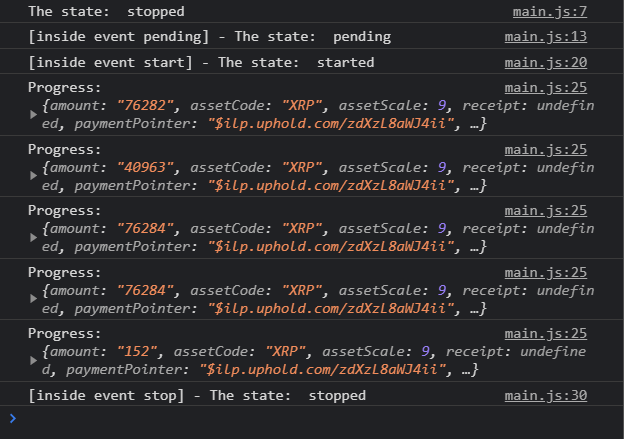

Puedes usar el evento de stop para saber en qué momento se detiene tu juego pero recuerda que este evento se emitirá también cuando cambies de ventana ya que se detendrá la monetización.

<br />

## Divide los ingresos

Con el plugin es posible dividir los ingresos para ello usamos reparto probabilistico de ingresos, te recomendamos que veas este enlace para obtener más detalles [aquí](https://webmonetization.org/docs/probabilistic-rev-sharing).

Cuando un usuario acceda a tu juego el plugin es capaz de seleccionar un paymentPointer dependiendo de un peso que asignemos, el peso global no debería pasar al 100% y tu puedes decidir cómo repartir ese peso, si quieres puedes por ejemplo poner a un colaborador un peso de 40 y a ti ponerte 60 y así tienes más posibilidad de que salga tu paymentPointer un 60% más que el de tu compañero que en global solo saldrá un 40%.

Una vez hayas configurado los múltiples paymentPointer el plugin internamente seleccionará uno aleatoriamente (pero teniendo en cuenta el peso) y se continuará trabajando todo igual como se ha enseñado en este tutorial.

Para configurar múltiples puntos de pagos puedes hacerlo modificando la configuración cuando instanciamos el plugin, agregaremos un array con múltiples payment pointer, tal cual el código: 

```javascript
const gameWebMonetization = new GameWebMonetization([
    {
        paymentPointer: '$ilp.uphold.com/zdXzL8aWJ4ii',
        weight: 60
    },
    {
        paymentPointer: '$ilp.uphold.com/ziW6E7iwKUkp',
        weight: 40
    }
]);

```

Ahora si vamos al evento start y hacemos un console.log al receive podremos comprobar que si actualizamos muchas veces el navegador se irán cambiando los payment pointer y eso es debido al peso que hemos asignado: 

```javascript
gameWebMonetization.on(GameWebMonetization.START, (event) => {
    console.log('[inside event start] - The state: ', event);
});
```

Al actualizar muchas veces podrás observar que se cambia el payment pointer: 

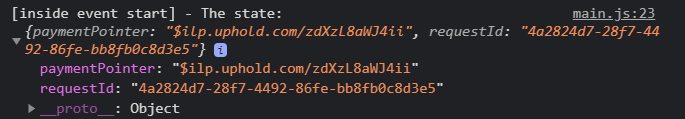


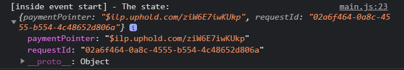

<br />

Si es un poco difícil saber a quién le pertenece cada payment pointer le podemos pasar en la configuración de manera opcional la propiedad pointerName de esta forma:

```javascript
const gameWebMonetization = new GameWebMonetization([
    {
        paymentPointer: '$ilp.uphold.com/zdXzL8aWJ4ii',
        weight: 60,
        pointerName: "Bob"
    },
    {
        paymentPointer: '$ilp.uphold.com/ziW6E7iwKUkp',
        weight: 40,
        pointerName: "Alice"
    }
]);

```

Para saber el nombre simplemente accedemos a la propiedad pointerName, lo haremos dentro del evento start (por ejemplo) de esta forma: 

```javascript
gameWebMonetization.on(GameWebMonetization.START, (event) => {
    console.log('[inside event start] - The state: ', gameWebMonetization.pointerName);
});
```

Vamos al navegador, actualizamos y miramos el nombre: 

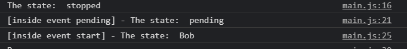

Y si actualizas podrás observar que se cambia el nombre: 

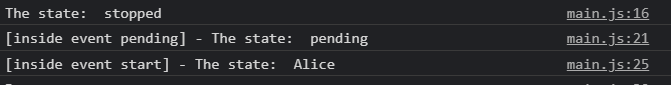

<br />

### Como cambiar el paymentPointer

Para cambiar el paymentPointer tenemos un método que se llama .**changePaymentPointer()**.

Para usarlo simplemente puedes llamarlo sin ningún problemas y asignar el nuevo paymentPointer de esta forma: 

```javascript
gameWebMonetization.changePaymentPointer({
    paymentPointer: '$ilp.uphold.com/ziW6E7iwKUkp',
    weight: 40,
    pointerName: "Alice"
});

```
Recuerda que el método es parte de la instancia de GameWebMonetization y no es un método estático. 

Ahora bien, **changePaymentPointer()** solo prepara el cambio pero no lo efectua, para que el cambio sea efectivo tendrás que detener la monetización con **.stop()** y luego reanudarla con **.start()**.

Bien ya tienes todo lo necesario para monetizar tus juegos, nos vemos en el siguiente tutorial.