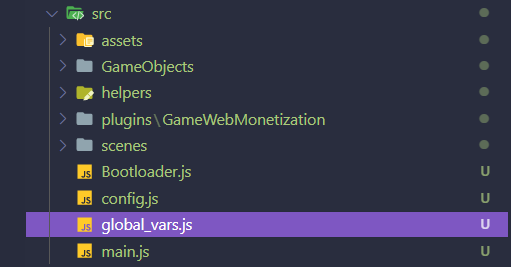
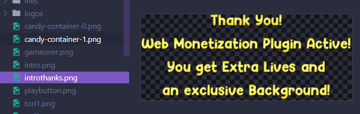

Aprendimos a probar las diferentes característica del plugin en la parte anterior de esta serie de tutoriales. Si te lo perdiste, vuelve a leerlo antes. Ahora es el momento de usar el plugin en un juego de Phaser 3 adecuado. En este tutorial, tomaremos un juego Phaser listo para usar y trabajaremos en la implementación del plugin Game Web Monetization en él.

## Descarga los archivos del Juego

Para comenzar, descargue o consulte el [Repositorio de GitHub de Game Web Monetization](https://github.com/photonstorm/gamewebmonetization). Si está familiarizado con el uso de git, puede consultar el repositorio a través de http:

```
https://github.com/photonstorm/gamewebmonetization.git
```

Or ssh:

```
git@github.com:photonstorm/gamewebmonetization.git
```

Si lo prefieres, puedes [descargar un archivo zip](https://github.com/photonstorm/gamewebmonetization/archive/refs/heads/main.zip) de todo el repositorio.

Una vez que los archivos estén en su computadora, encontrará el juego de muestra en la carpeta `tutorial/examples/3Candies`.

Arrastre y suelte la carpeta en Visual Studio Code o su editor de elección para que pueda ver fácilmente el código fuente de los distintos archivos.

# Estructura del proyecto

Dentro de la carpeta del juego podemos ver un archivo `index.html`, junto con las carpetas `src` y `phaser`. Todo ya está preconfigurado para ejecutarse, así que vamos a sumergirnos en la carpeta `src`.

Dentro de `src/plugins` verás una carpeta con el plugin Game Web Monetization en su interior.


El juego está dividido en 4 escenas de Phaser:

1. **Intro** - El mensaje de introducción y la comprobación del plugin.
2. **BackgroundScene** - El fondo que se desplaza detrás del juego.
3. **Menu** - El menú principal.
4. **MainScene** - La escena principal del juego.


También hay otro archivo importante: `src/global_vars.js`:



Este archivo contiene todas las variables que puedes cambiar fácilmente para modificar el juego en sí. Si abre el archivo en su editor, verá una sección comentada donde se almacena la configuración del plugin.

También verá un objeto llamado `background_selected`. Dentro de esto, la propiedad `active` se establece en `normal`. Esto controla si el juego se está ejecutando en el modo monetizado, o no, y lo utilizan **Menu** y **BackgroundScene** para mostrar diferentes fondos del juego.


## Adding Monetized Benefits

Agregaremos los siguientes beneficios al jugador si está monetizando nuestro juego:

* "¡Un gracias!" mensaje de introducción.
* La opción de cambiar el fondo por uno más colorido.
* Ganarán 1 vida extra durante el juego.

Ejecute el juego abriendo el `index.html` con el servidor web de su elección. Como antes, usaremos la extensión VS Code Live Server para esto. Abra el navegador y debería ver que el juego ha comenzado:


Hemos agregado una pantalla de introducción a nuestro juego. Esto se debe a que la API de monetización web puede tardar unos segundos en negociar, lo que es tiempo de sobra para mostrarles un mensaje breve sobre los beneficios de la misma.

### Importando el plugin

Llegó el momento de poner el plugin en nuestro juego.

Editamos el archivo **global_vars.js** e importamos el plugin arriba del todo, luego crea una instanacia del plugin:

```js
import { GameWebMonetization } from "./plugins/GameWebMonetization/GameWebMonetization.js";

// Monetization config
export const gamewebmonetization = new GameWebMonetization({
    paymentPointer: '$ilp.uphold.com/zdXzL8aWJ4ii'
});
```

Recuerde agregar el código anterior directamente debajo de la declaración de importación `CandyGrid`.

El código que agregó debería verse así:


El plugin se ha importado y creado con nuestro payment pointer. Ahora necesitamos iniciar el complemento en el archivo `scenes/Intro.js`.

Edite `Intro.js` e importe la instancia del complemento, para que podamos usarlo:

```javascript
import { gamewebmonetization } from "../global_vars.js";
```

Como has aprendido en el tutorial anterior, el plugin necesita su método `start`. Hay que llamarlo antes de que puedas realizar cualquier cosa con el plugin, llamaremos `start` en el método Scene `init`.

Agrega la siguiente línea de código al comienzo de `init`:

```js
gamewebmonetization.start();
```

El código se tiene que ver así:

```js
    init ()
    {
        gamewebmonetization.start();

        this.cameras.main.fadeIn(1000, 0, 0, 0);

        this.changingScene = true;
```

Junto con el código de importación la llamada debería verse de esta manera: 


Reinicia el juego en el navegador y, si tienes la extensión Coil funcionando, verás que el juego está monetizado:


## Agregando beneficios al jugador

Monetizar está muy bien, pero ahora deberíamos comenzar a brindar algunos beneficios a los jugadores que nos apoyan. Primero, mostremos un mensaje, "Thank you" .


Monetizar está bien pero ahora hay que empezar a darle bonificaciones al usuario o algún mensaje que indique los agradecimientos por apoyarnos.

En la carpeta `assets` verás dos PNG: `intro.png` y `introthanks.png`: 




Editaremos el código para mostrar el mensaje correcto, según el estado de la API.

Abre el archivo `Intro.js`, y ve hacia abajo dentro del método `create` donde se agrega la imagen `intro`:

```js
const intro = this.add.image(x, 240, 'intro');
```

Vamos a utilizar el evento del plugin `START` para cambiar esta textura. Ya hemos cargado todas las imágenes necesarias, por lo que todo lo que necesitamos es un event listener y actuar en consecuencia:

```javascript
const intro = this.add.image(x, 240, 'intro');

// Plugin here
gamewebmonetization.on("start", () => {
    intro.setTexture('introthanks');
});
```

Volvamos a nuestro juego y veamos qué sucede:


Cuando se activa el evento, la textura de la introducción se cambia a "Thank you!". Ahora vamos a darle al jugador la posibilidad de tener un fondo exclusivo.

### Cambiando el fondo premium

Cuando vayas al menú principal del juego, verás dos botones en la parte inferior. Estos le permiten al jugador alternar entre los fondos Estándar y Premium. Solo si están monetizados en la Web pueden elegir el fondo Premium. Si no es así, mostraremos un mensaje de alerta.

Recuerda la Parte 3 del tutorial que el plugin ofrece una propiedad booleana llamada `isMonetized`. Podemos leer `isMonetized` para saber si debemos habilitar ambos botones para el jugador.

Al igual que con las otras escenas, necesitamos importar el plugin y también vamos a importar el objeto `background_selected`. Esto almacenará nuestra elección de fondo de los botones:

```javascript
import { background_selected, gamewebmonetization } from "../global_vars.js";
```

Ahora podemos leer el booleano `isMonetized` y le daremos al botón Premium Background un leve alfa si no están monetizados. Agregue lo siguiente después de la línea `premiumBackgroundButton.setInteractive({ useHandCursor: true });`:

```js
if (!gamewebmonetization.isMonetized)
{
    premiumBackgroundButton.setAlpha(0.9);
}
```

El último cambio que haremos al botóm Premium es agregarle un evento `POINTER_DOWN`. El código se ve así:

```js
premiumBackgroundButton.on('pointerdown', (pointer, x, y, event) => {

    this.popfx.play();

    event.stopPropagation();

});
```

Cuando se hace click, todo lo que hace actualmente es reproducir un efecto de sonido. Comprobaremos el estado de monetización y actualizaremos el botón o mostraremos una alerta. Cambie el código anterior por el siguiente:

```js
premiumBackgroundButton.on('pointerdown', (pointer, x, y, event) => {

    this.popfx.play();

    if (gamewebmonetization.isMonetized)
    {
        this.isPremium = true;

        normalBackgroundButton.setTexture('normal_background-button');
        premiumBackgroundButton.setTexture('premium_background-button-selected');
    }
    else
    {
        alert('You need the plugin!');
    }

    event.stopPropagation();

});
```

Ahora, si vuelve al juego en el navegador, veras que tiene la opción de cambiar el fondo haciendo click en los dos botones:


### Vida extra

La última ventaja que le daremos al usuarios será una vida extra. 

Abre el archivo `scenes/MainScene.js` en su editor. En el método `create` verá el siguiente código:

```javascript
// Lifes
this.lifes = new Lifes(this, this.isMonetized);
```

Puede ver que cuando se crea el Game Object `Lifes`, le pasamos el booleano `isMonetized` como parámetro. En lugar de pasar este valor, puede pasar `true` o `false` para probar que sucede por ti mismo.

Ve al método `init`y cambia esta linea: 

```js
this.isMonetized = false;
```

Por esta:

```js
this.isMonetized = gamewebmonetization.isMonetized;
```

Con este cambio, el juego principal ahora detectará si la API está monetizada o no:


Si inicias el juego verás que ahora tienes 3 vidas y una de ellas es de oro. Esta es la vida extra que le dimos al jugador:


Como has visto, hay muchas posibilidades a la hora de utilizar el plugin Game Web Monetization. Hemos mencionado algunas ideas aquí, pero realmente las posibilidades de recompensar como quieras son casi infintas. Quizás incluso puedas considerar mostrar cuánto dinero te han enviado en el juego real, o cuanto mayor sea la cantidad que te envía más ventajas obtendrán. Realmente todo depende de ti.